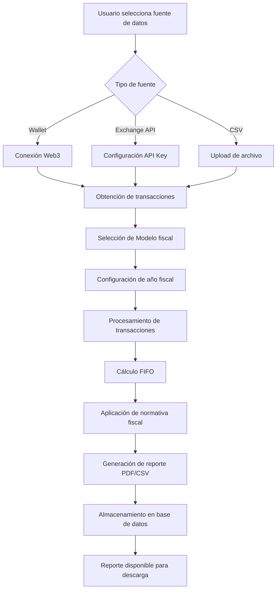

# Auto Crypto Tax - Whitepaper

**Versión 1.0**  
**Fecha: Noviembre 2025**

---

## Resumen Ejecutivo

Auto Crypto Tax es una plataforma SaaS diseñada para simplificar la declaración de impuestos sobre criptomonedas en España. La aplicación automatiza el complejo proceso de calcular ganancias y pérdidas patrimoniales derivadas de operaciones con activos digitales, generando reportes listos para presentar ante la Agencia Tributaria.

### Problema

Los ciudadanos españoles que invierten en criptomonedas enfrentan un desafío significativo: declarar correctamente sus operaciones con activos digitales. La legislación fiscal española requiere la declaración de:

- **Modelo 100** (IRPF): Ganancias y pérdidas patrimoniales
- **Modelo 720**: Declaración de bienes y derechos en el extranjero
- **Modelo 714**: Impuesto sobre el patrimonio

Estos requisitos implican:
- Rastrear cada transacción en múltiples plataformas (exchanges, wallets, DeFi)
- Calcular el valor de adquisición y transmisión en euros
- Aplicar el criterio FIFO (First In, First Out) para ventas parciales
- Diferenciar entre permutas de criptomonedas y ventas por fiat
- Mantener registros históricos precisos durante años

La complejidad aumenta exponencialmente con el número de transacciones y plataformas utilizadas, resultando en:
- Errores en las declaraciones fiscales
- Tiempo invertido considerable (decenas de horas)
- Costes elevados de asesoría fiscal especializada
- Riesgo de sanciones por declaración incorrecta

### Solución

Auto Crypto Tax automatiza completamente el proceso de declaración fiscal de criptomonedas mediante:

1. **Integración Multi-Plataforma**: Conexión directa con wallets blockchain y exchanges vía API
2. **Cálculo Automático**: Motor de procesamiento que aplica la normativa fiscal española
3. **Generación de Reportes**: Documentos PDF/CSV listos para la Agencia Tributaria
4. **Cumplimiento Normativo**: Actualización constante con cambios legislativos

---

## Visión y Misión

### Visión
Convertirnos en la plataforma líder en España para la gestión fiscal de activos digitales, democratizando el acceso a herramientas profesionales de tax reporting que anteriormente solo estaban disponibles para inversores institucionales.

### Misión
Eliminar la barrera técnica y temporal que impide a los ciudadanos españoles cumplir con sus obligaciones fiscales en criptomonedas, proporcionando una solución accesible, precisa y conforme a la legislación vigente.

---

## Marco Legal y Normativo

### Normativa Aplicable

La Agencia Tributaria española establece que las criptomonedas son **bienes inmateriales** sujetos a impuestos. Las operaciones relevantes incluyen:

#### 1. Venta de Criptomonedas por Fiat
- Genera ganancia o pérdida patrimonial
- Se declara en el periodo de la entrega (devengo)
- Cálculo: `Valor Transmisión - Valor Adquisición - Gastos`
- **Criterio FIFO** obligatorio para ventas parciales

**Ejemplo oficial (AEAT):**
```
Compra 1: 0.09 BTC por 3.000€ + 60€ comisión = 3.060€
Compra 2: 0.22 BTC por 6.000€ + 120€ comisión = 6.120€
Venta: 0.22 BTC por 14.046€ - 280€ comisión = 13.766€

Valor adquisición FIFO:
- 0.09 BTC × 3.060€ = 275,40€
- 0.13 BTC × (6.120€ × 0.13/0.22) = 3.616,36€
Total adquisición: 6.673,36€

Ganancia patrimonial: 13.766€ - 6.673,36€ = 7.092,96€
```

#### 2. Intercambio entre Criptomonedas (Permuta)
- Se valora como permuta según el mayor valor de mercado
- Genera ganancia o pérdida patrimonial
- Se declara en el periodo del intercambio

#### 3. Pérdidas por Quiebra de Plataforma
- Consideradas pérdidas patrimoniales de base general
- Imputables cuando el crédito resulte judicialmente incobrable
- La mera denuncia no es suficiente (Consulta DGT V1579-22)

#### 4. Integración Fiscal
- Las ganancias/pérdidas se integran en la **base imponible del ahorro**
- Casilla 1804: "Ganancias y pérdidas patrimoniales / Monedas virtuales"

### Obligaciones de Reporting

| Modelo | Descripción | Plazo |
|--------|-------------|-------|
| **Modelo 100** | IRPF - Ganancias y pérdidas | Anual (abril-junio) |
| **Modelo 720** | Bienes en el extranjero (>50.000€) | Anual (enero-marzo) |
| **Modelo 714** | Impuesto sobre el patrimonio | Anual (abril-junio) |

---

## Arquitectura Tecnológica

### Stack Tecnológico

```
Frontend:
├── Next.js 16 (App Router)
├── React 19
├── TypeScript 5
├── Tailwind CSS 4
└── shadcn/ui (Radix UI)

Backend:
├── Next.js API Routes
├── Prisma ORM
└── PostgreSQL

Integraciones:
├── Thirdweb (Web3 wallets)
├── Binance API
└── PDF-lib (generación de reportes)

Infraestructura:
├── Vercel (hosting)
└── PostgreSQL (base de datos)
```

### Arquitectura de Componentes

El proyecto sigue una arquitectura feature-based con separación clara de responsabilidades:

```
src/
├── app/                    # Next.js App Router (routing)
│   └── [feature]/page.tsx  # Páginas mínimas, solo enrutamiento
├── features/               # Módulos de negocio
│   └── [feature]/
│       ├── components/     # UI pura (presentacional)
│       ├── containers/     # Lógica de negocio + estado
│       ├── hooks/          # Custom hooks
│       ├── services/       # Integración con APIs
│       ├── types/          # TypeScript types
│       └── utils/          # Utilidades específicas
├── components/             # Componentes compartidos (UI library)
├── lib/                    # Utilidades globales
└── hooks/                  # Hooks globales
```

### Flow de Generación de Reportes



### Base de Datos

El modelo `ReportRequest` persiste todo el ciclo de vida de una generación:

```prisma
model ReportRequest {
  // Identificación
  id        String   @id @default(cuid())
  createdAt DateTime @default(now())
  
  // Datos de entrada
  dataSource  String?  // 'wallet' | 'csv' | 'api-key' | 'oauth' | 'manual'
  sourceData  Json?    // Datos variables según fuente
  
  // Configuración
  reportType  String?  // 'model-100' | 'model-720' | 'model-714'
  fiscalYear  Int?
  
  // Estado y progreso
  status          String  @default("draft")
  progress        Int?    @default(0)
  progressMessage String?
  
  // Resultado
  reportFileUrl      String?
  generatedReport    Json?
  fileFormat         String? // 'pdf' | 'csv'
  
  // Métricas
  totalTransactions Int?
  totalGains        Float?
  totalLosses       Float?
  netResult         Float?
}
```

### Seguridad y Privacidad

1. **No almacenamiento de claves privadas**: Solo lectura pública de blockchain
2. **Cifrado de API keys**: Las credenciales de exchange se cifran en base de datos
3. **GDPR compliance**: Los usuarios pueden eliminar todos sus datos
4. **HTTPS obligatorio**: Todas las comunicaciones cifradas
5. **Sesiones seguras**: Tokens de sesión con expiración

---

## Modelo de Negocio

### Propuesta de Valor

**Para Usuarios Individuales:**
- Ahorro de tiempo: De 20+ horas a 10 minutos
- Ahorro económico: Evita costes de asesoría fiscal (150-500€/año)
- Precisión garantizada: Motor de cálculo auditado
- Paz mental: Cumplimiento normativo asegurado

**Para Empresas/Asesores:**
- Escalabilidad: Gestionar múltiples clientes
- Templates personalizables: Branding propio
- API de integración: Incorporar en workflows existentes
- Panel administrativo: Supervisión centralizada

### Estrategia de Monetización

#### 1. Sistema de Suscripciones

| Plan | Precio | Límites Anuales | Características |
|------|--------|-----------------|----------------|
| **Free** | 0€ | 1 reporte/año | Hasta 50 transacciones |
| **Basic** | 29€/año | 5 reportes/año | Hasta 500 transacciones, 2 exchanges |
| **Pro** | 79€/año | Ilimitado | Transacciones ilimitadas, todos los exchanges, soporte prioritario |
| **Business** | 299€/año | Ilimitado | Todo lo anterior + API access, templates personalizados |

#### 2. White Label / Templates (Post-Lanzamiento 2026)

- **Target**: Asesorías fiscales, gestorías, contables
- **Modelo**: Licencia anual + comisión por uso
- **Precio**: 1.500€/año + 5€/reporte generado
- **Características**:
  - Branding personalizado
  - Dominio propio
  - Templates específicos de industria
  - Dashboard administrativo multi-cliente
- **Lanzamiento previsto**: Segundo semestre 2026 (una vez consolidado el producto core)

#### 3. Servicios Adicionales

- **Consultoría fiscal**: Partnership con asesores especializados (comisión 20%)
- **Auditoría de reportes**: Revisión manual por experto (49€)
- **Representación ante Hacienda**: Servicio premium (299€)

---

## Análisis de Mercado

### Tamaño del Mercado (España)

- **Inversores en cripto**: ~2.5 millones (14% población adulta)
- **Declarantes activos**: ~300.000 (estimado 12% de inversores)
- **Mercado objetivo inicial**: 50.000 usuarios (declarantes frecuentes)

### Competencia

| Competidor | Fortalezas | Debilidades | Precio |
|------------|-----------|-------------|--------|
| **Koinly** | Reconocimiento internacional, muchos exchanges | No específico España, inglés | 49€-179€/año |
| **CoinTracking** | Veterano del sector | UI anticuada, curva de aprendizaje | 10€-60€/mes |
| **CryptoTaxCalculator** | Automático | No optimizado para normativa española | 49€-199€/año |
| **Asesorías tradicionales** | Confianza, servicio personalizado | Caro, lento, manual | 150€-500€/consulta |

### Ventaja Competitiva

1. **Especialización en España**: Única solución 100% adaptada a normativa española
2. **UX superior**: Interfaz moderna, proceso guiado paso a paso
3. **Precio competitivo**: 70% más barato que asesoría tradicional
4. **Actualizaciones normativas**: Equipo dedicado a cambios legislativos
5. **Soporte en español**: Atención al cliente nativa

---

## Estrategia de Producto

### Módulos en Desarrollo (Noviembre 2025 - Enero 2026)

#### 1. Generación de Reportes 🚧
- **Estado**: Implementado (80% completo)
- **Completitud esperada**: Enero 2026
- **Características implementadas**:
  - Conexión con wallets Web3 (MetaMask, WalletConnect)
  - Integración con Binance API
  - Generación de Modelo 100 (IRPF)
  - Cálculo FIFO automatizado
  - Export PDF/CSV
  - Almacenamiento de reportes en base de datos
- **Pendiente para lanzamiento (enero 2026)**:
  - Coinbase integration
  - WhiteBit integration
  - Modelos 720 y 714
  - Testing exhaustivo y validación con asesores fiscales

#### 2. Sistema de Suscripciones 🚧
- **Estado**: En desarrollo
- **Completitud esperada**: Diciembre 2025
- **Características planificadas**:
  - Integración con Stripe
  - Planes Free, Basic, Pro, Business
  - Sistema de límites y quotas
  - Billing automático
  - Panel de usuario con historial
  - Email notifications

#### 3. Panel Administrativo 🚧
- **Estado**: En desarrollo
- **Completitud esperada**: Enero 2026
- **Características planificadas**:
  - Dashboard con métricas básicas
  - Gestión de usuarios admin
  - Sistema de permisos/roles
  - Logs y monitoreo básico

---

## Plan de Desarrollo Técnico

**Objetivo Global**: Completar toda la plataforma y lanzar a producción en enero 2026

### Fase 1: Generación de Reportes (Noviembre 2025)
**Objetivo**: Completar módulo core de generación de reportes

**Noviembre 2025:**
- [ ] Integración Coinbase API (2 semanas)
- [ ] Integración WhiteBit API (2 semanas)
- [ ] Testing exhaustivo de cálculos FIFO (1 semana)
- [ ] Generación de Modelo 720 (1 semana - versión inicial)
- [ ] Generación de Modelo 714 (1 semana - versión inicial)

### Fase 2: Sistema de Suscripciones (Diciembre 2025)
**Objetivo**: Implementar monetización completa

**Diciembre 2025:**
- [ ] Diseño de arquitectura de suscripciones (1 semana)
- [ ] Integración Stripe (2 semanas)
- [ ] Sistema de límites y quotas (1 semana)
- [ ] Panel de usuario con historial (1 semana)
- [ ] Email notifications (3 días)
- [ ] Testing de pagos (3 días)

### Fase 3: Panel Administrativo (Diciembre 2025 - Enero 2026)
**Objetivo**: Herramientas de gestión para el negocio

**Diciembre 2025 - Enero 2026:**
- [ ] Dashboard con métricas básicas (1 semana)
- [ ] Gestión de usuarios admin (1 semana)
- [ ] Sistema de permisos/roles básicos (3 días)
- [ ] Logs y monitoreo básico (2 días)

### Fase 4: Testing y Lanzamiento (Enero 2026)
**Objetivo**: Validación y lanzamiento público

**Enero 2026:**
- [ ] UI/UX polish final (1 semana)
- [ ] Testing con usuarios beta (1 semana)
- [ ] Validación con asesores fiscales (3 días)
- [ ] Corrección de bugs críticos (3 días)
- [ ] Lanzamiento a producción (finales de enero)

---

## Go-to-Market Strategy

### Preparación Pre-Lanzamiento (Noviembre-Diciembre 2025)
**Objetivo**: Construir base de usuarios y expectativa antes del lanzamiento

**Estrategia:**
1. **Content Marketing temprano**:
   - Blog sobre fiscalidad cripto
   - Guías "Cómo declarar Bitcoin en España"
   - SEO para keywords long-tail
   - Preparar material educativo
2. **Build-in-public**:
   - Compartir progreso en Twitter/X
   - Engagements en comunidades cripto españolas
3. **Beta list**:
   - Landing page con waitlist
   - Early access para primeros 100 usuarios

### Lanzamiento (Enero 2026)
**Objetivo**: Lanzamiento público exitoso con sistema completo funcional

**Enero 2026 - Lanzamiento Público:**
- Anuncio oficial en todas las comunidades
- Soft launch con primeros usuarios
- Beta testing activo con feedback continuo
- Iteración rápida basada en feedback

**Canales de Lanzamiento:**
1. **Comunidades**:
   - Telegram/Discord de cripto español
   - Reddit r/SpainFIRE, r/BitcoinES
   - Twitter/X con contenido educativo
2. **Partnerships iniciales**:
   - Influencers cripto españoles
   - Podcasts de inversión
3. **PR**:
   - Comunicados a medios especializados
   - Artículos en blogs de cripto

### Post-Lanzamiento (Febrero 2026 en adelante)
**Objetivo**: Crecimiento sostenido y optimización

**Canales:**
1. **Paid Advertising** (a partir de febrero):
   - Google Ads (keywords intención alta)
   - Twitter Ads (targeting cripto investors)
   - LinkedIn Ads (profesionales)
2. **Referral Program**:
   - 1 mes gratis Pro por cada referido
3. **Partnerships Estratégicos**:
   - Asesorías fiscales
   - Exchanges españoles (Bit2Me)
4. **Contenido continuo**:
   - Blog semanal
   - Guías avanzadas
   - Webinars educativos

---

## Equipo y Organización

### Estructura Actual
- **Fundador/CTO**: Desarrollo full-stack, arquitectura
- **Asesor Fiscal**: Validación de cálculos y normativa (freelance)

### Necesidades de Contratación (Post-Lanzamiento)

**Post-lanzamiento (Marzo-Abril 2026):**
- Customer Support (part-time) - 20k€ - Para manejar consultas y feedback inicial

**Si hay crecimiento rápido (Mayo-Junio 2026):**
- Frontend Developer (React/Next.js) - 30-40k€ - Para escalar funcionalidades
- Backend Developer (Node.js/PostgreSQL) - 35-45k€ - Para optimización y nuevas integraciones

**Crecimiento sostenido (2027 en adelante):**
- Product Designer (UI/UX) - 30-40k€ - Para mejorar experiencia
- Sales Manager (B2B) - 40-50k€ + comisiones - Para expansión enterprise
- Content Marketing Manager - 30-35k€ - Para escalar contenido y SEO

---

## Riesgos y Mitigación

### Riesgos Técnicos

| Riesgo | Probabilidad | Impacto | Mitigación |
|--------|--------------|---------|------------|
| Errores en cálculos FIFO | Media | Crítico | Testing exhaustivo, auditoría externa, insurance |
| APIs de exchanges caídas | Alta | Medio | Retry logic, fallbacks, cache |
| Escalabilidad de procesamiento | Media | Alto | Queue system, serverless functions |

### Riesgos de Negocio

| Riesgo | Probabilidad | Impacto | Mitigación |
|--------|--------------|---------|------------|
| Cambios regulatorios | Alta | Alto | Equipo legal asesor, actualizaciones rápidas |
| Competencia internacional | Media | Medio | Diferenciación en UX y localización |
| Adopción lenta | Media | Alto | Marketing agresivo, freemium model |
| Caída del mercado cripto | Media | Crítico | Diversificación (B2B), runway de 12+ meses |

### Riesgos Legales

| Riesgo | Probabilidad | Impacto | Mitigación |
|--------|--------------|---------|------------|
| Demandas por errores fiscales | Baja | Crítico | Disclaimer legal, seguro de responsabilidad civil |
| GDPR violations | Baja | Alto | Auditoría de privacidad, DPO externo |
| Licencias para asesoría fiscal | Media | Alto | Clarificar que es herramienta, no asesoría |

---

## Métricas Clave (KPIs)

### Métricas de Producto
- **Reportes generados / mes**: Indicador de uso activo
- **Tasa de éxito de generación**: Calidad del servicio (objetivo: >95%)
- **Tiempo medio de generación**: Performance (objetivo: <2 min)
- **NPS (Net Promoter Score)**: Satisfacción (objetivo: >50)

### Métricas de Negocio
- **MRR (Monthly Recurring Revenue)**: Ingresos recurrentes
- **CAC (Customer Acquisition Cost)**: Coste de adquisición
- **LTV (Lifetime Value)**: Valor de vida del cliente
- **Churn Rate**: Tasa de cancelación (objetivo: <5% mensual)
- **Conversion Rate (Free → Paid)**: Objetivo: 8-12%

### Métricas de Crecimiento
- **Usuarios activos mensuales (MAU)**
- **Tasa de crecimiento semana a semana**: Objetivo: +10% W/W en fase inicial
- **Viral coefficient**: Referidos por usuario (objetivo: >1.0)

---

## Visión a Largo Plazo

### 2028-2030: Expansión Europea

Una vez consolidado el mercado español, Auto Crypto Tax expandirá a:

1. **Portugal**: Normativa fiscal cripto similar a España
2. **Italia**: Gran mercado de cripto, necesidades similares
3. **Francia**: Regulación avanzada, alta adopción cripto
4. **Alemania**: Mercado maduro, alta disposición a pagar

### Ecosistema de Productos

**Auto Crypto Tax Suite:**
- **Tax Reporting** (actual)
- **Portfolio Tracker**: Seguimiento en tiempo real de holdings
- **Tax Loss Harvesting**: Optimización fiscal automatizada
- **DeFi Accounting**: Contabilidad completa de operaciones DeFi
- **NFT Valuation**: Valoración fiscal de NFTs

### Innovación Tecnológica

- **AI-powered tax optimization**: IA que sugiere estrategias fiscales
- **Blockchain de auditoría**: Trazabilidad inmutable de cálculos
- **Contratos inteligentes**: Automatización de pagos fiscales
- **Open source tools**: Liberación de componentes core como open source

---

## Conclusión

Auto Crypto Tax está posicionado para convertirse en el estándar de facto para la declaración de criptomonedas en España. Con una combinación de:

- **Especialización técnica**: Deep domain expertise en fiscalidad cripto española
- **Tecnología moderna**: Stack escalable y mantenible
- **Modelo de negocio validado**: SaaS con múltiples líneas de ingresos
- **Ventana de oportunidad**: Mercado en crecimiento, competencia débil en localización

El proyecto tiene el potencial de crecer de un MVP a un negocio de 7 cifras en 3-5 años, con posibilidades de expansión europea y diversificación de productos.

La clave del éxito reside en:
1. Ejecución impecable del módulo de reportes (precisión del 100%)
2. Construcción de confianza mediante transparencia y educación
3. Iteración rápida basada en feedback de usuarios
4. Escalabilidad técnica y de negocio desde el inicio

---

**Siguiente paso inmediato (Noviembre 2025)**: Completar todas las integraciones (Coinbase, WhiteBit), implementar sistema de suscripciones y panel administrativo, realizar testing exhaustivo, y validar precisión de cálculos con al menos 3 asesores fiscales independientes. Todo debe estar listo para el lanzamiento público completo en enero 2026.

---

*Este documento es un living document y será actualizado trimestralmente con progreso, learnings y ajustes de estrategia.*

